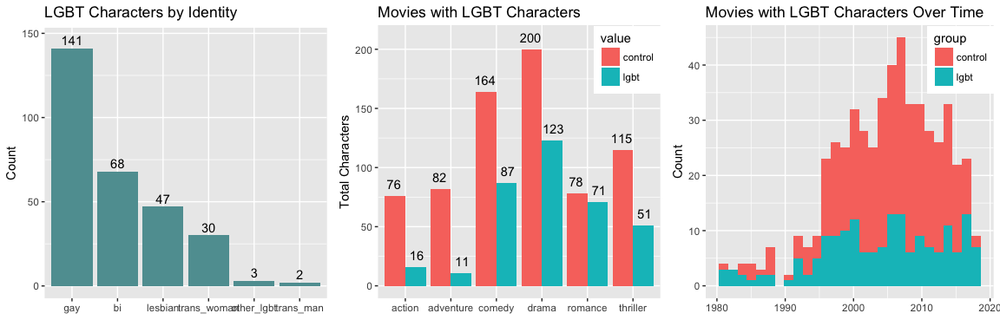
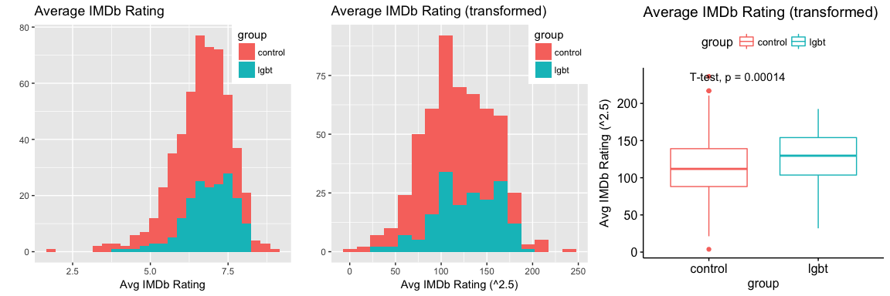
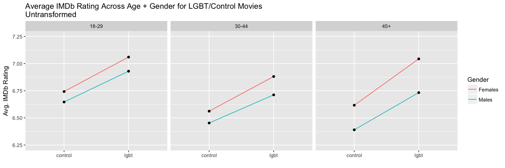
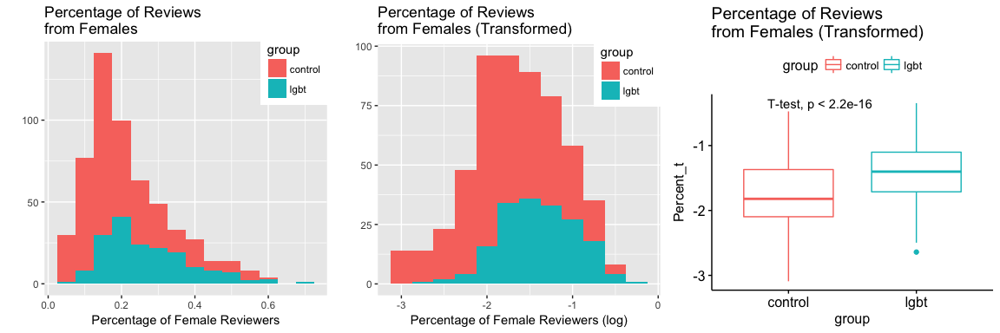
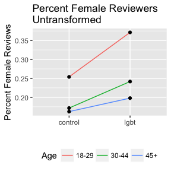

Do IMDb Ratings Differ Between Movies With and Without LGBT Representation?
================
Kaylin Pavlik
April 2018

An analysis of IMDb ratings and reviewer makeup for movies with LGBT representation in comparison to movies without.

### Findings

1.  LGBT representation is largely dominated by gay male characters. Lesbian and trans characters are few and far between, especially depictions of trans men.
2.  LGBT characters are most likely to be found in romance, drama and comedy genres. Action and adventure lack LGBT representation the most.
3.  Movies with LGBT representation have higher ratings than those without. The increase is small, about 0.27 (a bump from 7.10 to 7.37, e.g.) but still significant after controlling for release date, rating, and genre of the movie. This trend is consistent across reviewer age group and gender.
4.  Movies with LGBT representation have a larger percentage of reviews from women than other movies (the overall average is 19% of reviews from women). Overall, there is about a 7% increase in female reviews for movies with LGBT representation, even after controlling for release date, rating and genre. The effect is strongest in younger age groups, with an increase of about 12% for the 18-29 group, 7% for 30-44, and 3% for 45+.

### A note on methodology

To create dataset for this analysis, I first needed a list of LGBT characters in movies. Wikipedia has an extensive list, so I started there: <https://en.wikipedia.org/wiki/List_of_films_with_LGBT_characters>. I scraped the movie name, release year, actor name, character name, and classification ("gay", "lesbian", "trans woman"). The list is subject to the biases of its Wikipedia contributors, and is certainly not exhaustive or 100% accurate. For example, I omitted the Harry Potter movies because Dumbledore's sexual orientation is inferred from the books and never explicitly noted in the movie series. The rest of the list was taken at face value.

Then, I scraped IMDb [movie](http://www.imdb.com/title/tt0162677/) and [rating](http://www.imdb.com/title/tt0162677/ratings?ref_=tt_ov_rt) information by searching the movie's name and release year. I also matched each character to their listing position on IMDb - their billing - to help determine how central a character is to a movie's plot. IMDb lists characters in the order they are credited in the movie credits, which is usually descending based on screen time, but sometimes is in order of appearance. This will be important later.

That yielded ~450 LGBT characters and ~300 movies. In order to compare this sample to "non-LGBT" movies, I grabbed a sample of 300 movies from [this dataset](https://github.com/walkerkq/fan_favorite_actors/blob/master/movieInfo.csv). The sample was weighted by release year to mimic the distribution of the LGBT character sample (more movies from recent years). For analysis, the dataset was restricted to movies released during or after 1980 with at least 2000 IMDb ratings.

Next, the movies were split into two groups: **LGBT** and **control**.

-   **LGBT**: The movie had at least one LGBT character with billing in the top 5 (i.e. listed in the first 5 characters on IMDb); n=176
-   **control**: All other movies in the sample (including movies with LGBT characters listed 6th or later); n=361

Here's a peek at the source data before it is combined into one workable dataset.

#### Character data from Wikipedia and IMDb

| id                | character  | classification | actor      |  billing|
|:------------------|:-----------|:---------------|:-----------|--------:|
| /title/tt0134119/ | Tom Ripley | Bisexual       | Matt Damon |        1|

#### IMDb Metadata

| id                | title                   | release\_date |  imdb\_rating| group |
|:------------------|:------------------------|:--------------|-------------:|:------|
| /title/tt0134119/ | The Talented Mr. Ripley | 1999-12-25    |           7.4| lgbt  |

#### IMDb Reviewer Demographics

| Gender  | Age    |  Rating|  Count| id                |
|:--------|:-------|-------:|------:|:------------------|
| Females | &lt;18 |     8.1|     20| /title/tt0134119/ |
| Females | 18-29  |     7.6|   8623| /title/tt0134119/ |
| Females | 30-44  |     7.4|  14082| /title/tt0134119/ |
| Females | 45+    |     7.5|   3850| /title/tt0134119/ |
| Males   | &lt;18 |     7.8|     48| /title/tt0134119/ |
| Males   | 18-29  |     7.5|  21732| /title/tt0134119/ |
| Males   | 30-44  |     7.3|  53603| /title/tt0134119/ |
| Males   | 45+    |     7.2|  15953| /title/tt0134119/ |

1. Exploratory Data Analysis
----------------------------

First, an exploration of the dataset of LGBT characters and movies.

``` r
# LGBT representation by type
char_type <- data.frame(group=names(movies)[18:23], count=colSums(movies[,c(18:23)], na.rm=T))
plot_char_count_type <- char_type %>% 
  arrange(desc(count)) %>%
  mutate(group = factor(group, levels=group)) %>%
  ggplot(aes(group, count)) + geom_bar(stat="identity", fill="cadetblue") + geom_text(aes(x=group, y=count+5, label=count)) +
  labs(title="LGBT Characters by Identity", x="", y="Count")

# LGBT representation by genre
char_genre <- movies[,c(8:13,26)] %>%
  melt(id = "group") %>%
  mutate(variable = gsub("genre_", "", variable)) %>%
  aggregate(value ~ variable + group, data=., FUN=sum)  %>%
  set_colnames(c("variable","value", "count")) 

plot_char_count_billing <- char_genre %>%
  ggplot(aes(variable, count, fill=value)) + geom_bar(stat="identity", position="dodge") +
  geom_text(aes(x=variable, y=count+10, label=count), position = position_dodge(width = 1)) +
  labs(title="Movies with LGBT Characters",x="", y="Total Characters")+ theme(legend.justification=c(1,0), legend.position=c(1,0.75))

# LGBT representation over time
plot_char_count_time <- ggplot(movies, aes(release_date)) + geom_histogram(aes(fill=group), binwidth=500) +
  labs(title="Movies with LGBT Characters Over Time",x="", y="Count") + 
  theme(legend.justification=c(1,0), legend.position=c(1,0.75)) 

grid.arrange(plot_char_count_type, plot_char_count_billing,plot_char_count_time, ncol=3)
```



Clearly, gay men dominate LGBT representation in movies, making up more than half of the dataset. Trans men get the least representation.

LGBT characters appear most often in drama, comedies and romance movies, and least often in action and adventure. LGBT characters are equally likely to have top 5 billing in those categories (about 70%) but only about 50% of LGBT characters in action and adventure movies get top billing.

The dataset is skewed to include more movies from 1995-now than 1980-1995, which is reflective of which movies get reviewed on IMDb (more users rate current movies than older movies). LGBT representation has been fairly flat since 2000, ranging from 3-8 movies per year (!!).

2. IMDb Ratings
---------------

#### 2.a. Higher IMDb Ratings Overall

The distribution of ratings (IMDb creates an average of ratings with some unknown weighting) is left skewed. A transformation to the 2.5 power brings it closer to normality. A t-test between the control and LGBT movie groups shows a significant difference in the IMDb ratings of the two groups, with movies with LGBT characters rated higher.

``` r
# IMDb Rating Distribution by Group, Histogram
imdb_rating_dist <- ggplot(movies, aes(imdb_rating)) + geom_histogram(aes(fill=group), binwidth=0.3) + 
  labs(title="Average IMDb Rating", x="Avg IMDb Rating", y="") +
  theme(legend.justification=c(1,0), legend.position=c(1,0.75))

# IMDb Rating Distribution, Transformed
imdb_rating_dist_transformed <- ggplot(movies, aes(imdb_rating_t)) + geom_histogram(aes(fill=group),  binwidth=15) + 
  labs(title="Average IMDb Rating (transformed)", x="Avg IMDb Rating (^2.5)", y="") +
  theme(legend.justification=c(1,0), legend.position=c(1,0.75))

# IMDb Rating Distribution by Group, Boxplot
imdb_rating_boxplot <- ggboxplot(movies, x="group", y="imdb_rating_t", color="group") + stat_compare_means(method="t.test") + 
  labs(title="Average IMDb Rating (transformed)", y="Avg IMDb Rating (^2.5)")

# Print
grid.arrange(imdb_rating_dist, imdb_rating_dist_transformed, imdb_rating_boxplot, ncol=3)
```



There could be other factors causing this. To find out, I took genre, release date, and MPAA rating into account. The release date was not significant, but the genres and MPAA rating were. R rated movies and dramas get higher ratings, while comedies, romance and thrillers get lower ratings. Despite adding these features into the model, the LGBT factor was still significant, contributing about 0.27 to the rating (e.g. a bump from 7.0 to 7.27). The table below shows each feature's contribution (intercept is the starting value, plus/minus the feature's value if present).

``` r
# fit linear regression model with transformed IMDb rating var as dependent variable
rating_fit <- lm(imdb_rating_t ~ group + release_date + mpaa_rating_f + genre_drama + genre_comedy + 
              genre_action + genre_romance + genre_adventure + genre_thriller, movies) 
summary(rating_fit)
```

    ## 
    ## Call:
    ## lm(formula = imdb_rating_t ~ group + release_date + mpaa_rating_f + 
    ##     genre_drama + genre_comedy + genre_action + genre_romance + 
    ##     genre_adventure + genre_thriller, data = movies)
    ## 
    ## Residuals:
    ##      Min       1Q   Median       3Q      Max 
    ## -105.316  -21.565    1.304   20.964  109.303 
    ## 
    ## Coefficients:
    ##                      Estimate Std. Error t value Pr(>|t|)    
    ## (Intercept)         1.157e+02  9.439e+00  12.259  < 2e-16 ***
    ## grouplgbt           1.113e+01  3.410e+00   3.263 0.001178 ** 
    ## release_date       -5.723e-04  5.463e-04  -1.048 0.295383    
    ## mpaa_rating_fPG-13  6.122e+00  5.601e+00   1.093 0.274905    
    ## mpaa_rating_fR+     1.238e+01  5.956e+00   2.078 0.038185 *  
    ## genre_drama         1.937e+01  4.004e+00   4.837 1.76e-06 ***
    ## genre_comedy       -1.804e+01  3.710e+00  -4.863 1.56e-06 ***
    ## genre_action        3.428e+00  4.657e+00   0.736 0.462020    
    ## genre_romance      -8.418e+00  3.831e+00  -2.197 0.028466 *  
    ## genre_adventure     2.412e+00  4.662e+00   0.517 0.605085    
    ## genre_thriller     -1.527e+01  4.007e+00  -3.811 0.000156 ***
    ## ---
    ## Signif. codes:  0 '***' 0.001 '**' 0.01 '*' 0.05 '.' 0.1 ' ' 1
    ## 
    ## Residual standard error: 33.47 on 492 degrees of freedom
    ##   (34 observations deleted due to missingness)
    ## Multiple R-squared:  0.2214, Adjusted R-squared:  0.2055 
    ## F-statistic: 13.99 on 10 and 492 DF,  p-value: < 2.2e-16

``` r
# fit the same model to untransformed data for interpretation
rating_fit_ut <- lm(imdb_rating ~ group + release_date + mpaa_rating_f + genre_drama + genre_comedy + 
              genre_action + genre_romance + genre_adventure + genre_thriller, movies)
rating_fit_coef <- round(rating_fit_ut$coefficients,6)
kable(rating_fit_coef[c(1,2,5,6,7,9,11)], caption="Significant Coefficients, Untransformed")
```

|                   |          x|
|-------------------|----------:|
| (Intercept)       |   6.473353|
| grouplgbt         |   0.277151|
| mpaa\_rating\_fR+ |   0.381859|
| genre\_drama      |   0.503753|
| genre\_comedy     |  -0.410452|
| genre\_romance    |  -0.173474|
| genre\_thriller   |  -0.335065|

#### 2.b. Higher IMDb Ratings from Each Demographic Group

Does this hold across age groups and genders? Next, I looked at the IMDb rating average from each group age/gender combination, which IMDb offers for [each movie](http://www.imdb.com/title/tt0162677/ratings?ref_=tt_ov_rt). Because there are so few reviews from the age group &lt;18, the group will be dropped.

``` r
# Get a count of ratings by age group and gender; drop groups with less than 100
# Transform the IDMb rating variable
gender_age_rate <- ratings %>%
  subset(!Gender %in% "All" & !Age %in% c("All Ages") & Count > 100) %>%
  mutate(Rating_t = Rating^2.5) %>%
  left_join(movies[,c("id", "group")],by="id") %>%
  subset(!is.na(group))

# Table: Number of Ratings by Reviewer Gender and Age for LGBT/Control Movies
gender_age_rate %>% 
  aggregate(Count ~ Age + Gender, data=., sum) %>% dcast(Age ~ Gender) %>%
  kable(caption="Reviewer Counts")
```

| Age    |  Females|     Males|
|:-------|--------:|---------:|
| &lt;18 |    17637|     70503|
| 18-29  |  4936424|  16126355|
| 30-44  |  4369674|  21977783|
| 45+    |   965653|   4752265|

``` r
# get rid of <18 group since it has too few entries
gender_age_rate <- gender_age_rate %>% subset(Age != "<18")
```

Based on the interaction plot below (shown untransformed for interpretability), there are both age and gender effects on IMDb rating. The youngest age group, 18-29, rates movies higher than the 30-44 and 45+ age groups, on average. Females of all age groups rate movies higher than males (especially females over 45). There is also a main effect where movies with LGBT representation garner higher ratings from all age and genders groups.

``` r
# Group, age and gender interaction plot
gender_age_rate %>%
  group_by(Gender, Age, group) %>%
  summarise(rating_group = mean(Rating)) %>%
  ggplot(aes(group, rating_group)) + geom_line(aes(group=Gender, color=Gender)) + 
  geom_point() + facet_wrap(~Age, ncol=4) + ylim(c(6.25,7.25)) +
  labs(title="Average IMDb Rating Across Age + Gender for LGBT/Control Movies\nUntransformed", 
       y="Avg. IMDb Rating", x= "")
```



An ANOVA confirms that gender, age group, and LGBT characters all significantly impact IMDb ratings. The interactions (group/age, group/gender, age/gender) were not found to be significant. The Tukey family-wise comparison (untransformed for interpretability) shows that the movie having an LGBT character billed in the top 5 represents a 0.32 increase in rating. The reviewer being female contributes a 0.15 bump, and being in the 18-29 age group increases the rating 0.19 vs. 45+ and 30-44.

``` r
# fit linear model with interactions
gender_age_rate_fit <- lm(Rating_t ~ group + Age*group + Gender*group + Age*Gender, data=gender_age_rate)

# view ANOVA
anova(gender_age_rate_fit)
```

    ## Analysis of Variance Table
    ## 
    ## Response: Rating_t
    ##                Df  Sum Sq Mean Sq F value    Pr(>F)    
    ## group           1  123498  123498 92.2865 < 2.2e-16 ***
    ## Age             2   45415   22707 16.9686 4.658e-08 ***
    ## Gender          1   34346   34346 25.6660 4.282e-07 ***
    ## group:Age       2    2531    1265  0.9456   0.38855    
    ## group:Gender    1    2637    2637  1.9703   0.16051    
    ## Age:Gender      2    6849    3425  2.5590   0.07753 .  
    ## Residuals    3305 4422764    1338                      
    ## ---
    ## Signif. codes:  0 '***' 0.001 '**' 0.01 '*' 0.05 '.' 0.1 ' ' 1

``` r
# view Tukey family-wise error
TukeyHSD(aov(Rating ~ group + Age + Gender, data=gender_age_rate))
```

    ##   Tukey multiple comparisons of means
    ##     95% family-wise confidence level
    ## 
    ## Fit: aov(formula = Rating ~ group + Age + Gender, data = gender_age_rate)
    ## 
    ## $group
    ##                   diff       lwr      upr p adj
    ## lgbt-control 0.3227155 0.2555529 0.389878     0
    ## 
    ## $Age
    ##                    diff         lwr         upr     p adj
    ## 30-44-18-29 -0.19029789 -0.28112791 -0.09946786 0.0000028
    ## 45+-18-29   -0.16822216 -0.25962684 -0.07681748 0.0000487
    ## 45+-30-44    0.02207573 -0.06892184  0.11307329 0.8367236
    ## 
    ## $Gender
    ##                     diff       lwr         upr p adj
    ## Males-Females -0.1615667 -0.223751 -0.09938233 4e-07

3. Percentage of Female Reviewers
---------------------------------

#### 3.a. Higher Percentage of Female Reviewers Overall

The percentage of IMDb reviews that come from women is [extremely skewed](https://oneroomwithaview.com/2016/08/10/imdb-analysed-men-womens-favourite-films-differ/). On average, just 19% of ratings for a given movie on IMDb are from females. To fix this skew, the distribution was transformed using a log transform. A t-test showed that this hypothesis is true - the control and LGBT groups differ significantly in the percentage of female reviews, with the LGBT group gaining more reviews from women than the control group.

``` r
gender_age_pct <- ratings %>%
  subset(!Gender %in% "All") %>%
  group_by(Age, id) %>%
  mutate(Sum = sum(Count), 
         Gender_Percent = case_when(Count > 100 ~ Count/Sum)) %>%
  ungroup() %>%
  select(c("id", "Gender", "Age", "Gender_Percent")) %>%
  left_join(movies[,c("id", "group")],by="id") %>%
  subset(!is.na(group))

# Transform percent female var
gender_age_pct$Percent_t <- log(gender_age_pct$Gender_Percent)

# Percent female reviewers 
pct_female_dist <- gender_age_pct %>%
  subset(Gender %in% "Females" & Age %in% "All Ages") %>% 
  ggplot(aes(Gender_Percent)) + geom_histogram(aes(fill=group), binwidth=0.05) +
  labs(title="Percentage of Reviews\nfrom Females", x="Percentage of Female Reviewers", y="") +
  theme(legend.justification=c(1,0), legend.position=c(1,0.75))

# Percent female reviewers, transformed
pct_female_dist_transformed <- gender_age_pct %>%
  subset(Gender %in% "Females" & Age %in% "All Ages") %>% 
  ggplot(aes(Percent_t)) + geom_histogram(aes(fill=group), binwidth=0.25) +
  labs(title="Percentage of Reviews\nfrom Females (Transformed)", x="Percentage of Female Reviewers (log)", y="") +
  theme(legend.justification=c(1,0), legend.position=c(1,0.75))

# Percent female reviewers boxplot
pct_female_boxplot <- gender_age_pct %>%
  subset(Gender %in% "Females" & Age %in% "All Ages") %>% 
  ggboxplot(x="group", y="Percent_t", color="group") + stat_compare_means(method="t.test") + 
  labs(title="Percentage of Reviews\nfrom Females (Transformed)")

# Print
grid.arrange(pct_female_dist, pct_female_dist_transformed, pct_female_boxplot, ncol=3)
```



Is this influenced by other factors? After taking release date, genre, and MPAA rating into account, the LGBT group was still found to be significant, contributing about a 7% increase in ratings from females.

``` r
# restrict to females, all ages; select variables
gender_age_pct_female <- gender_age_pct %>% 
  subset(Gender %in% "Females" & Age %in% "All Ages") %>% 
  left_join(movies[,c(1,4,8:13,25)]) 

# fit linear model on transformed pct
gender_age_pct_fit <- gender_age_pct_female %>% select(-c(1:4)) %>% 
  lm(Percent_t ~ ., data=.)
summary(gender_age_pct_fit)
```

    ## 
    ## Call:
    ## lm(formula = Percent_t ~ ., data = .)
    ## 
    ## Residuals:
    ##      Min       1Q   Median       3Q      Max 
    ## -1.25884 -0.27686 -0.00946  0.30851  1.47042 
    ## 
    ## Coefficients:
    ##                      Estimate Std. Error t value Pr(>|t|)    
    ## (Intercept)        -2.181e+00  1.243e-01 -17.543  < 2e-16 ***
    ## grouplgbt           4.006e-01  4.657e-02   8.602  < 2e-16 ***
    ## release_date        1.765e-05  7.290e-06   2.421 0.015787 *  
    ## genre_drama         2.744e-01  5.304e-02   5.174 3.18e-07 ***
    ## genre_comedy       -1.473e-02  4.980e-02  -0.296 0.767424    
    ## genre_action       -2.574e-01  5.846e-02  -4.403 1.28e-05 ***
    ## genre_romance       5.861e-01  5.104e-02  11.482  < 2e-16 ***
    ## genre_adventure     3.976e-01  5.984e-02   6.644 7.13e-11 ***
    ## genre_thriller      8.988e-02  5.321e-02   1.689 0.091753 .  
    ## mpaa_rating_fPG-13 -2.321e-01  6.655e-02  -3.488 0.000525 ***
    ## mpaa_rating_fR+    -2.750e-01  7.222e-02  -3.808 0.000155 ***
    ## ---
    ## Signif. codes:  0 '***' 0.001 '**' 0.01 '*' 0.05 '.' 0.1 ' ' 1
    ## 
    ## Residual standard error: 0.468 on 570 degrees of freedom
    ##   (34 observations deleted due to missingness)
    ## Multiple R-squared:  0.4204, Adjusted R-squared:  0.4102 
    ## F-statistic: 41.34 on 10 and 570 DF,  p-value: < 2.2e-16

``` r
# fit on untransformed dependent variable for interpretability
gender_age_pct_fit_ut <- gender_age_pct_female %>% 
  select(-c(1:3,6)) %>% 
  lm(Gender_Percent ~ ., data=.)

# print coefficients
gender_age_pct_fit_coef <- round(gender_age_pct_fit$coefficients,6)
kable(gender_age_pct_fit_coef[-c(5)], caption="Significant Coefficients, Untransformed")
```

|                      |          x|
|----------------------|----------:|
| (Intercept)          |  -2.181070|
| grouplgbt            |   0.400619|
| release\_date        |   0.000018|
| genre\_drama         |   0.274387|
| genre\_action        |  -0.257386|
| genre\_romance       |   0.586101|
| genre\_adventure     |   0.397587|
| genre\_thriller      |   0.089878|
| mpaa\_rating\_fPG-13 |  -0.232090|
| mpaa\_rating\_fR+    |  -0.275000|

Dramas, romance, thrillers, and adventure movies were more likely to have higher percentages of female reviewers, while action movies and movies rated PG-13 or R were less likely.

#### 3.b. Higher Percentage of Female Reviewers in Each Age Group

Is there a certain age group that influences this more than others? According to the interaction plot below, there is a main effect between the LGBT and control groups, with the LGBT group being higher across all age groups. There is an interaction with age, showing that the effect is stronger in younger reviewers.

``` r
# Restrict to females broken into age groups, minus 18 and under
# Transform percent variable
gender_age_pct_gf <- gender_age_pct %>%
  subset(!is.na(Gender_Percent) & !Age %in% c("<18", "All Ages") & Gender %in% "Females") %>%
  mutate(Gender_Percent_t = log(Gender_Percent)) # transform

# Interaction plot for age, gender, and group
gender_age_pct_gf %>%
  group_by(Age, group) %>%
  summarise(pct_group = mean(Gender_Percent)) %>%
  ggplot(aes(group, pct_group)) + geom_line(aes(group=Age, color=Age)) + 
  geom_point() + theme(legend.position="bottom") +
  labs(title="Percent Female Reviewers\nUntransformed", 
       y="Percent Female Reviews", x= "")
```



An ANOVA confirmed that age group, LGBT/control, and an interaction between age group and LGBT/control are all significant influences on the percentage of female reviewers for a movie.

A Tukey family-wise comparison showed that the percentage of female reviewers was lower as age groups increased, and that being in the LGBT group contributed to about 7% more female reviewers. For the interaction, it showed that all age groups had higher percentage of female reviewers for movies in the LGBT group, but the effect was uneven, being strongest for 18-29 and weakest for those 45+.

``` r
# fit a linear model to explore interaction
gender_age_pct_interact <- lm(Gender_Percent_t ~ Age*group, data=gender_age_pct_gf)
summary(gender_age_pct_interact)
```

    ## 
    ## Call:
    ## lm(formula = Gender_Percent_t ~ Age * group, data = gender_age_pct_gf)
    ## 
    ## Residuals:
    ##      Min       1Q   Median       3Q      Max 
    ## -1.62955 -0.30334  0.00333  0.32392  1.30539 
    ## 
    ## Coefficients:
    ##                    Estimate Std. Error t value Pr(>|t|)    
    ## (Intercept)        -1.56370    0.02615 -59.806  < 2e-16 ***
    ## Age30-44           -0.34482    0.03676  -9.380  < 2e-16 ***
    ## Age45+             -0.33152    0.03710  -8.936  < 2e-16 ***
    ## grouplgbt           0.46295    0.04686   9.880  < 2e-16 ***
    ## Age30-44:grouplgbt -0.07240    0.06582  -1.100 0.271513    
    ## Age45+:grouplgbt   -0.24225    0.06697  -3.617 0.000307 ***
    ## ---
    ## Signif. codes:  0 '***' 0.001 '**' 0.01 '*' 0.05 '.' 0.1 ' ' 1
    ## 
    ## Residual standard error: 0.507 on 1632 degrees of freedom
    ## Multiple R-squared:  0.1987, Adjusted R-squared:  0.1962 
    ## F-statistic: 80.93 on 5 and 1632 DF,  p-value: < 2.2e-16

``` r
anova(gender_age_pct_interact)
```

    ## Analysis of Variance Table
    ## 
    ## Response: Gender_Percent_t
    ##             Df Sum Sq Mean Sq  F value    Pr(>F)    
    ## Age          2  55.10  27.548 107.1731 < 2.2e-16 ***
    ## group        1  45.38  45.379 176.5459 < 2.2e-16 ***
    ## Age:group    2   3.53   1.766   6.8699  0.001069 ** 
    ## Residuals 1632 419.49   0.257                       
    ## ---
    ## Signif. codes:  0 '***' 0.001 '**' 0.01 '*' 0.05 '.' 0.1 ' ' 1

``` r
TukeyHSD(aov(Gender_Percent ~ Age*group, data=gender_age_pct_gf))
```

    ##   Tukey multiple comparisons of means
    ##     95% family-wise confidence level
    ## 
    ## Fit: aov(formula = Gender_Percent ~ Age * group, data = gender_age_pct_gf)
    ## 
    ## $Age
    ##                    diff         lwr         upr     p adj
    ## 30-44-18-29 -0.09687729 -0.11336424 -0.08039035 0.0000000
    ## 45+-18-29   -0.11732305 -0.13402281 -0.10062329 0.0000000
    ## 45+-30-44   -0.02044575 -0.03704218 -0.00384933 0.0108915
    ## 
    ## $group
    ##                    diff       lwr       upr p adj
    ## lgbt-control 0.07475785 0.0625009 0.0870148     0
    ## 
    ## $`Age:group`
    ##                                     diff          lwr          upr
    ## 30-44:control-18-29:control -0.082190749 -0.106364213 -0.058017284
    ## 45+:control-18-29:control   -0.091548442 -0.115946221 -0.067150664
    ## 18-29:lgbt-18-29:control     0.117345064  0.086531013  0.148159115
    ## 30-44:lgbt-18-29:control    -0.012272467 -0.042781870  0.018236936
    ## 45+:lgbt-18-29:control      -0.055989023 -0.087390577 -0.024587469
    ## 45+:control-30-44:control   -0.009357694 -0.033613428  0.014898041
    ## 18-29:lgbt-30-44:control     0.199535813  0.168834106  0.230237520
    ## 30-44:lgbt-30-44:control     0.069918282  0.039522349  0.100314215
    ## 45+:lgbt-30-44:control       0.026201726 -0.005089593  0.057493046
    ## 18-29:lgbt-45+:control       0.208893507  0.178014873  0.239772140
    ## 30-44:lgbt-45+:control       0.079275975  0.048701346  0.109850605
    ## 45+:lgbt-45+:control         0.035559420  0.004094489  0.067024350
    ## 30-44:lgbt-18-29:lgbt       -0.129617531 -0.165521042 -0.093714020
    ## 45+:lgbt-18-29:lgbt         -0.173334087 -0.209998729 -0.136669445
    ## 45+:lgbt-30-44:lgbt         -0.043716556 -0.080125537 -0.007307574
    ##                                 p adj
    ## 30-44:control-18-29:control 0.0000000
    ## 45+:control-18-29:control   0.0000000
    ## 18-29:lgbt-18-29:control    0.0000000
    ## 30-44:lgbt-18-29:control    0.8612505
    ## 45+:lgbt-18-29:control      0.0000060
    ## 45+:control-30-44:control   0.8812034
    ## 18-29:lgbt-30-44:control    0.0000000
    ## 30-44:lgbt-30-44:control    0.0000000
    ## 45+:lgbt-30-44:control      0.1605845
    ## 18-29:lgbt-45+:control      0.0000000
    ## 30-44:lgbt-45+:control      0.0000000
    ## 45+:lgbt-45+:control        0.0162278
    ## 30-44:lgbt-18-29:lgbt       0.0000000
    ## 45+:lgbt-18-29:lgbt         0.0000000
    ## 45+:lgbt-30-44:lgbt         0.0082416
